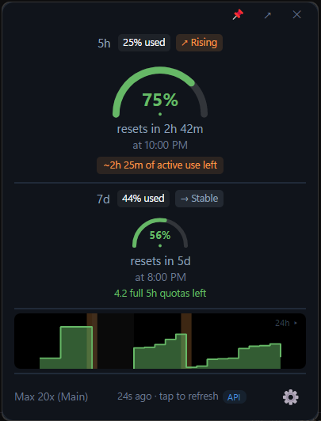
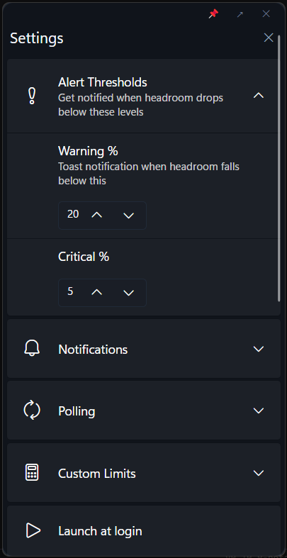
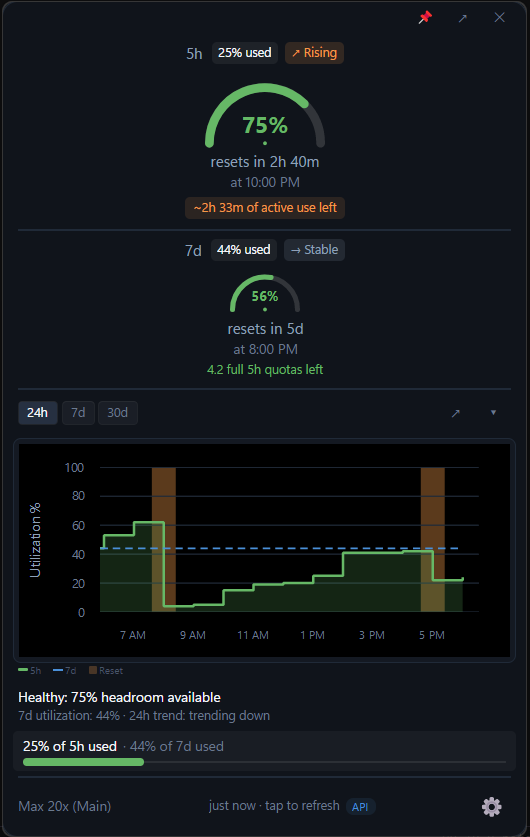
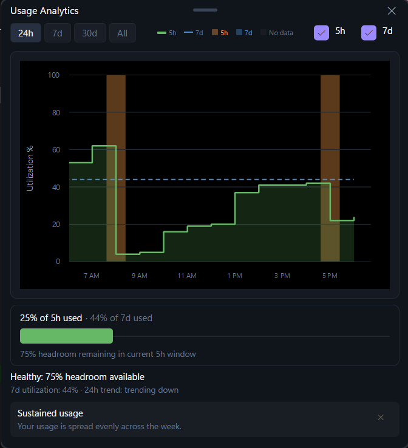

<h1 align="center">CC-Stats (Windows)</h1>

<p align="center">
  Claude API headroom monitor for your Windows system tray.<br>
  Never get surprise-throttled mid-task.
</p>

<p align="center">
  <a href="https://github.com/Codename-11/CC-Stats/releases"></a>
  <a href="https://github.com/Codename-11/CC-Stats/actions/workflows/windows-ci.yml"></a>
  <a href="https://opensource.org/licenses/MIT"></a>
  <a href="https://dotnet.microsoft.com/download/dotnet/8.0"></a>
</p>

<p align="center">
  <a href="#installation">Install</a> ·
  <a href="#features">Features</a> ·
  <a href="#screenshots">Screenshots</a> ·
  <a href="#development">Dev</a> ·
  <a href="./CHANGELOG.md">Changelog</a>
</p>

---

> **Windows port** of [rajish/cc-hdrm](https://github.com/rajish/cc-hdrm) (macOS SwiftUI). Built with Avalonia 11, .NET 8, ReactiveUI, and LiveCharts2.

## Screenshots

<p align="center">
  
  &nbsp;&nbsp;
  
</p>

<p align="center">
  
  &nbsp;&nbsp;
  
</p>

## Features

### Headroom Monitoring
- **Ring gauges** for 5-hour and 7-day windows with animated fill, color-coded severity
- **Trend badges** showing slope direction: ↘ Declining (green), → Stable, ↗ Rising (orange), ⬆ Rapid (red)
- **Budget estimate** with contextual status line: "On track -- 2h until reset" (green) or "~25m of active use left" (orange)
- **Projected exhaustion** dashed forecast line on the 24h chart
- **Countdown timers** with reset time and absolute timestamp

### Data Sources
- **API-first polling** with automatic token refresh and exponential backoff
- **Local cache fallback** reads Claude Code's statusline cache for instant data on startup and during rate limiting
- **Data source indicator** (API/Live/Cached) with color-coded pill and detailed tooltip
- **4-layer fallback**: API → Local cache → Credentials-only → In-memory stale

### Analytics
- **Inline expandable chart** with 24h/7d/30d time ranges, sparkline, and step-area visualization
- **Popout analytics window** (resizable, borderless) with bar charts, zoom, and legends
- **Gap and reset detection** with color-coded markers (orange = 5h reset, blue = 7d reset, gray = no data)
- **Pattern detection cards** identifying overpaying, underpowering, usage spikes, sustained usage
- **Headroom breakdown bar** with percentage and remaining headroom
- **Cycle comparison** chart (Earlier/Recent/Now) for 30d+ views

### Accounts & Auth
- **One-click OAuth** via browser (PKCE) -- no API keys or config files
- **Multi-account support** with per-account encrypted storage, hot-swap from tray or footer
- **Re-auth account matching** -- re-authenticating reconnects to existing account data
- **Zero tokens spent** -- reads quota data only, never the chat API

### Notifications & Alerts
- **Configurable threshold alerts** with Warning % and Critical % settings
- **Toast notifications** (pill-shaped, slide-down) with success/error/info types
- **Extra usage tracking** with dollar amounts, 4-tier color ramp, and billing alerts
- **API status alerts** for outages and recovery

### System Integration
- **System tray icon** with dynamic gauge, account switcher, and context menu
- **Dock to taskbar** -- bottom-anchored, grows upward, always-on-top pin toggle
- **Adaptive polling** -- speeds to 30s when Claude Code is running, slows when idle
- **Self-update** -- check for updates in settings, download and restart in-place
- **Launch at login** toggle

## Installation

### From GitHub Releases

Download the latest `CCStats-vX.Y.Z-win-x64.exe` from [Releases](../../releases) and run it.

Self-contained single-file executable -- no .NET SDK or runtime needed.

### From Source

```bash
git clone https://github.com/Codename-11/CC-Stats.git
cd CC-Stats
dotnet run --project windows/CCStats.Desktop/CCStats.Desktop.csproj
```

**Requirements:** Windows 10 (build 17763+), .NET 8 SDK (for source builds only).

## Development

```bash
./run_dev.sh              # Bash -- auto-kills stale processes, logs visible, Ctrl+C works
.\run_dev.ps1             # PowerShell -- builds first, then runs with log output
dotnet build windows/CCStats.Windows.sln
dotnet test windows/CCStats.Tests   # 193 tests
```

### Local Release Build

```bash
.\build_local.ps1                      # Build with csproj version
.\build_local.ps1 -Version 0.3.0      # Build as v0.3.0
.\build_local.ps1 -Version 0.3.0 -Run # Build and launch
```

Produces a self-contained single-file exe in `publish/` matching the CI output.

Press **F5** in the app to cycle preview states (Signed Out → Authorizing → Connected → Critical → Disconnected).

### Tech Stack

| Component | Technology |
|-----------|-----------|
| UI | [Avalonia 11.3](https://avaloniaui.net) + [FluentAvalonia 2.2](https://github.com/amwx/FluentAvalonia) |
| State | [ReactiveUI](https://reactiveui.net) + MVVM |
| Charts | [LiveCharts2](https://livecharts2.com) (SkiaSharp) |
| Database | SQLite via [Microsoft.Data.Sqlite](https://learn.microsoft.com/en-us/dotnet/standard/data/sqlite/) |
| Credentials | DPAPI encryption (`DataProtectionScope.CurrentUser`) |
| Notifications | [Microsoft.Toolkit.Uwp.Notifications](https://learn.microsoft.com/en-us/windows/apps/design/shell/tiles-and-notifications/send-local-toast) |
| Tests | [xUnit](https://xunit.net/) (193 tests) |
| Target | .NET 8 (`net8.0-windows10.0.17763.0`) |

### Project Structure

```
windows/
├── CCStats.Core/              # Platform-agnostic: models, state, services
│   ├── Models/                # AppState, HeadroomState, WindowState, UsageSource, etc.
│   ├── State/                 # Immutable AppState record
│   ├── Services/              # OAuth, Polling, API, DB, Preferences (14 services)
│   └── Formatting/            # Date/time formatting
├── CCStats.Desktop/           # Avalonia desktop app
│   ├── Controls/              # Ring gauge, countdown, sparkline, extra usage bar
│   ├── Services/              # Tray icon, toast, launch-at-login
│   ├── ViewModels/            # MVVM ViewModels (Main, Analytics, Settings)
│   └── Views/                 # AXAML views + code-behind
└── CCStats.Tests/             # xUnit test project (193 tests)
    ├── SlopeCalculationServiceTests.cs
    ├── DateTimeFormattingTests.cs
    ├── RateLimitTierTests.cs
    ├── AppStateTests.cs
    └── AccountItemViewModelTests.cs
```

### Data Storage

| File | Location | Purpose |
|------|----------|---------|
| `credentials.dat` | `%APPDATA%/CCStats/` | Active account credentials (DPAPI encrypted) |
| `account_*.dat` | `%APPDATA%/CCStats/` | Per-account credential files |
| `preferences.json` | `%APPDATA%/CCStats/` | User settings and thresholds |
| `ccstats.db` | `%APPDATA%/CCStats/` | SQLite database (polls, rollups, resets, outages) |

## Upstream

Windows port of [rajish/cc-hdrm](https://github.com/rajish/cc-hdrm) (macOS SwiftUI/AppKit menu bar app). Feature parity achieved plus Windows-exclusive features: multi-account, adaptive polling, projected exhaustion, budget calculator, local cache fallback, data source tracking, schema migrations, and self-update.

## License

Same license as upstream. See [LICENSE](LICENSE).
